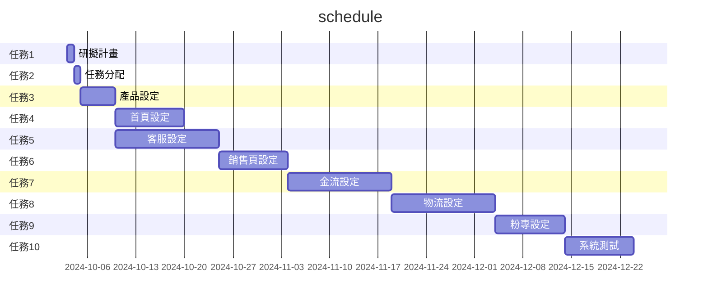
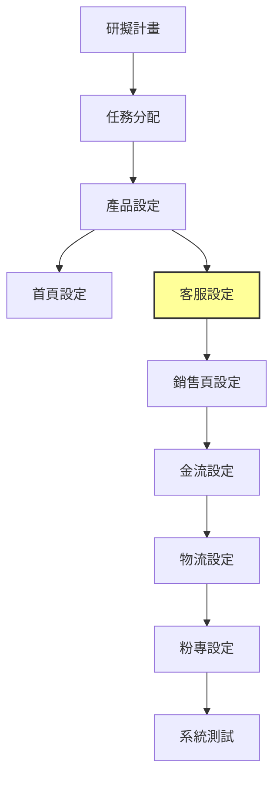
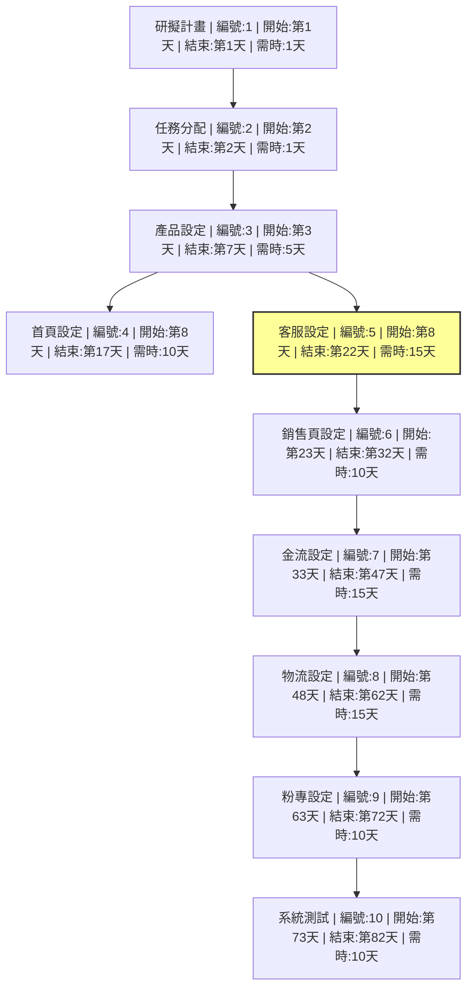

# E-commerce_MiDo-Bakery
組長 陳廷瑋 C111118143

組員 簡世昌 C111118142
***

```mermaid
gantt
    title schedule

    section 任務1
    研擬計畫:        a1, 2024-10-03, 1d

    section 任務2
    任務分配:        a2, after a1, 1d

    section 任務3
    產品設定:        a3, after a2, 5d

    section 任務4
    首頁設定:        a4, after a3, 10d

    section 任務5
    客服設定:        a5, after a3, 15d

    section 任務6
    銷售頁設定:      a6, after a5, 10d

    section 任務7
    金流設定:        a7, after a6, 15d

    section 任務8
    物流設定:        a8, after a7, 15d

    section 任務9
    粉專設定:        a9, after a8, 10d

    section 任務10
    系統測試:       a10, after a9, 10d

```

&nbsp;
&nbsp;

```mermaid
graph TD
    1[研擬計畫] --> 2[任務分配]
    2    --> 3[產品設定]
    3    --> 4[首頁設定]
    3    --> 5[客服設定]
    5    --> 6[銷售頁設定]
    6    --> 7[金流設定]
    7    --> 8[物流設定]
    8    --> 9[粉專設定]
    9    --> 10[系統測試]

    style 5 fill:#ffff99,stroke:#333,stroke-width:2px

```

&nbsp;
&nbsp;

```mermaid
   graph TD
    no1["研擬計畫 | 編號:1 | 開始:第1天 | 結束:第1天 | 需時:1天"] --> no2["任務分配 | 編號:2 | 開始:第2天 | 結束:第2天 | 需時:1天"]
    no2 --> no3["產品設定 | 編號:3 | 開始:第3天 | 結束:第7天 | 需時:5天"]

    no3 --> no4["首頁設定 | 編號:4 | 開始:第8天 | 結束:第17天 | 需時:10天"]
    no3 --> no5["客服設定 | 編號:5 | 開始:第8天 | 結束:第22天 | 需時:15天"]

    no5 --> no6["銷售頁設定 | 編號:6 | 開始:第23天 | 結束:第32天 | 需時:10天"]
    no6 --> no7["金流設定 | 編號:7 | 開始:第33天 | 結束:第47天 | 需時:15天"]
    no7 --> no8["物流設定 | 編號:8 | 開始:第48天 | 結束:第62天 | 需時:15天"]
    no8 --> no9["粉專設定 | 編號:9 | 開始:第63天 | 結束:第72天 | 需時:10天"]
    no9 --> no10["系統測試 | 編號:10 | 開始:第73天 | 結束:第82天 | 需時:10天"]

    style no5 fill:#ffff99,stroke:#333,stroke-width:2px
```
