# E-commerce_MiDo-Bakery
組長 陳廷瑋 C111118143

組員 簡世昌 C111118142
***

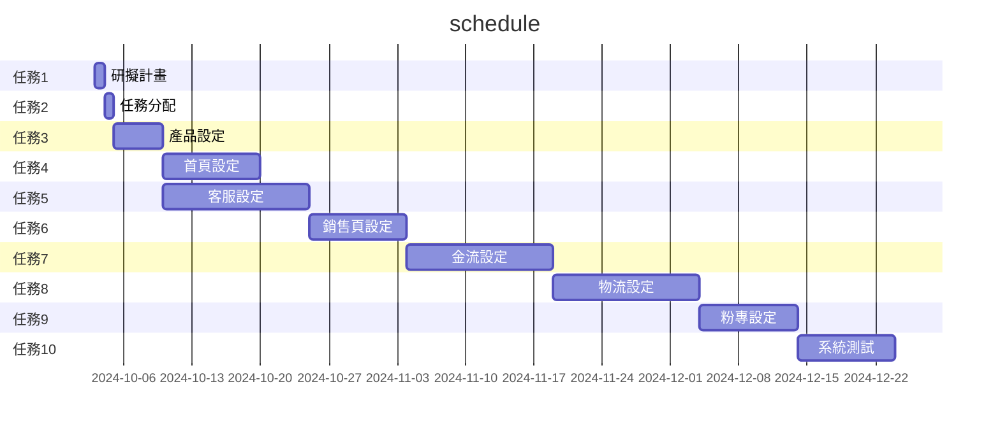

&nbsp;
&nbsp;

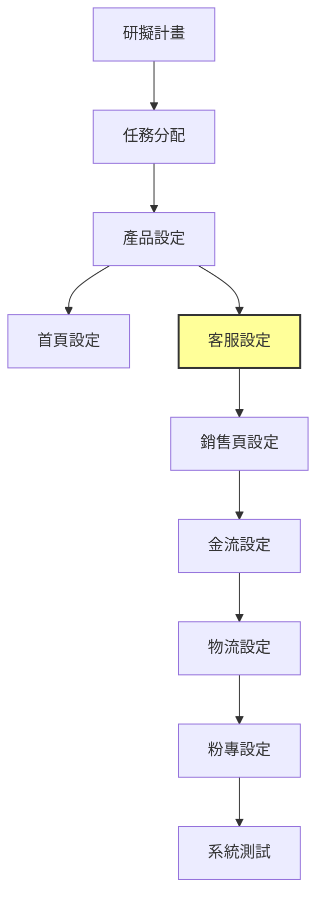

&nbsp;
&nbsp;

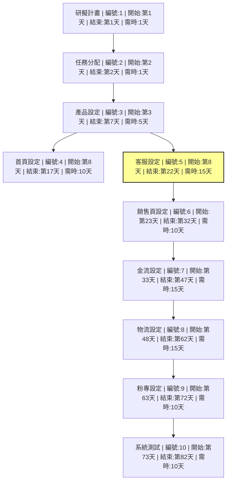

***

# 功能性需求
1.用戶註冊和登入：系統能夠允許用戶註冊帳號，並通過帳號和密碼進行登入。  
2.多語言支持：系統能夠根據用戶偏好顯示不同語言的內容。  
3.搜尋功能：系統應允許用戶根據特定條件（如名稱、類別等）進行資料搜索。   

# 非功能性需求
1.安全性：實施多重身份驗證機制，並使用加密技術保護數據。  
2.兼容性：支持主流的作業系統（如Windows、macOS、Linux）和瀏覽器（如Chrome、Firefox、Safari）。  
3.可靠性：保證在故障情況下數據不丟失，並能自動恢復正常運行。  

# 功能分解圖
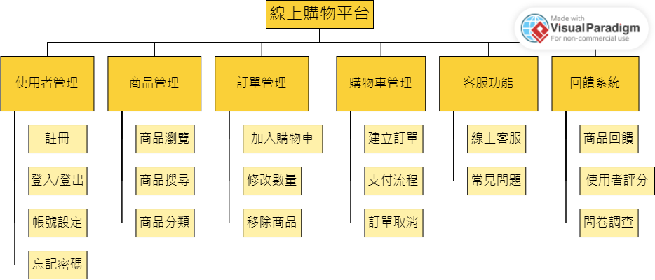  

# 使用案例圖
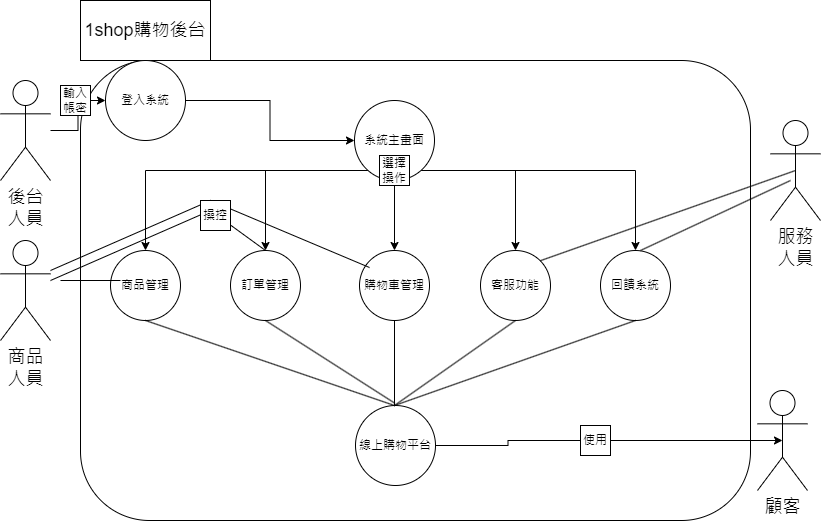

# 使用案例1：用戶登入系統
說明：後台人員輸入帳號密碼，才可進入後台操作  
## 流程：
1.後台人員輸入帳號和密碼。  
2.系統驗證有無錯誤並分別身分。  
3.正確後轉入系統畫面，錯誤則轉入登入畫面並顯示錯誤訊息。

# 使用案例2：後台人員操控資料
說明：商品人員操控販售類資料，服務人員操控服務類資料  
## 流程：
1.商品人員可操控商品管理頁面，訂單管理頁面，購物車管理頁面。  
* 商品管理頁面：商品瀏覽、商品搜尋、商品分類。  
* 訂單管理頁面：加入購物車、修改數量、移除商品。  
* 購物車管理頁面：建立訂單、支付流程、訂單取消。  
  
2.服務人員可操控客服服務頁面，回饋系統頁面。
* 客服功能：線上客服、常見問題。  
* 回饋系統：商品評分、顧客評分、問卷調查。  
  
# 使用案例3：線上購物平台操作
說明：顧客可至平台購買商品，遇到問題也可詢問客服，也可以根據使用心得回饋平台。  
## 流程：
1.顧客進入登入系統，輸入帳號和密碼。  
2.顧客進入購物平台，可依照分類或者自行搜索商品。  
3.購物完畢後，可進入購物車修改商品數量及移除商品。  
4.如果對於商品或服務有問題，可以透過客服來詢問。  
5.收到貨物後，可依照服務滿意度和商品品質，進行回饋並改正。  
***

# 系統環境圖 (System DFD)
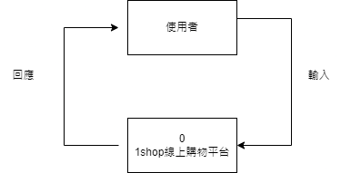  

# 資料流向圖0 (DFD 0)
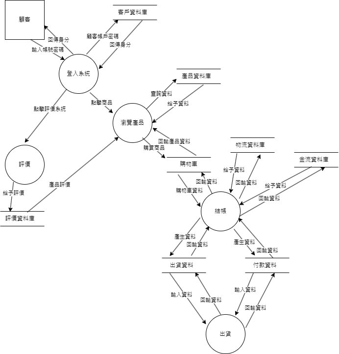
***

# UML類別圖 (Class Diagram)
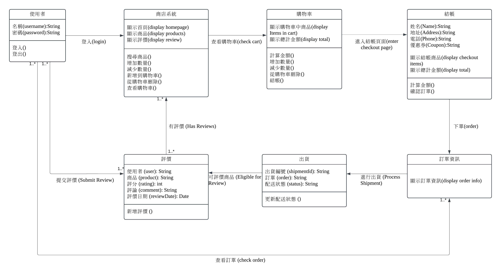

# 使用案例一：使用者登入 (User Login)
## 循序圖
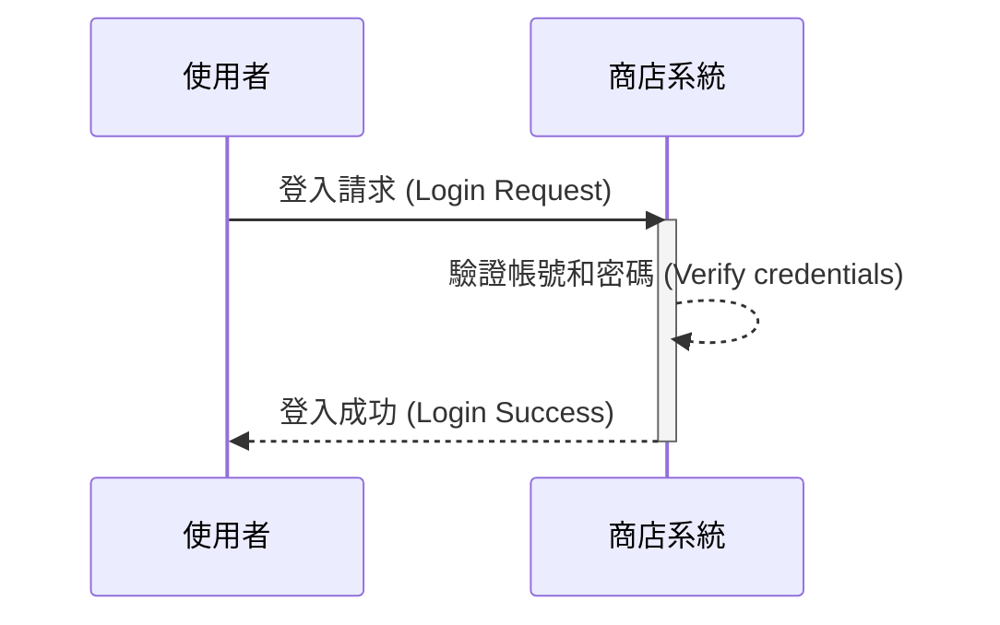
## 活動圖
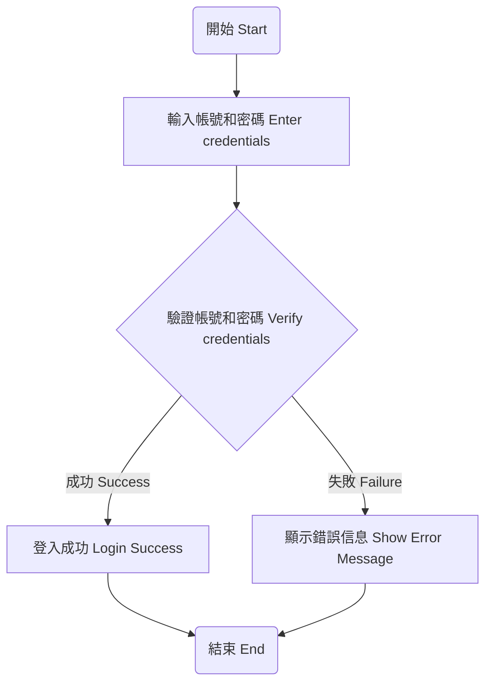
# 使用案例二：購物車結帳 (Checkout Shopping Cart)
## 循序圖
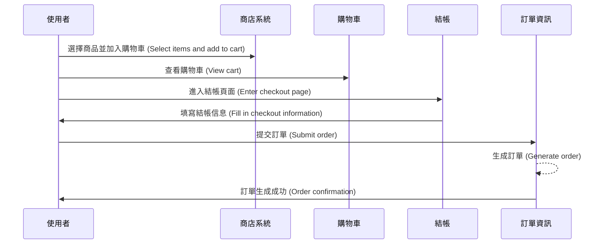
## 活動圖
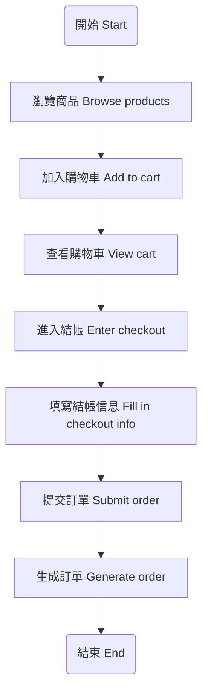
# 使用案例三：商品評價 (Submit Review for Product)
## 循序圖
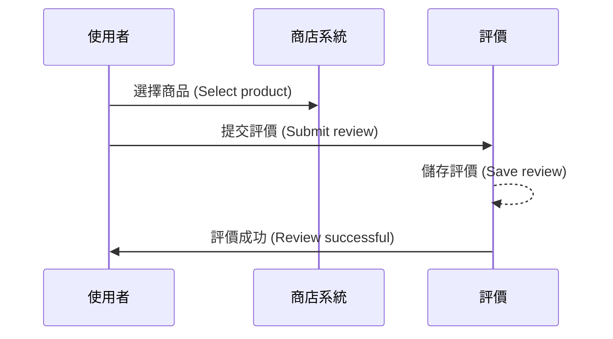
## 活動圖
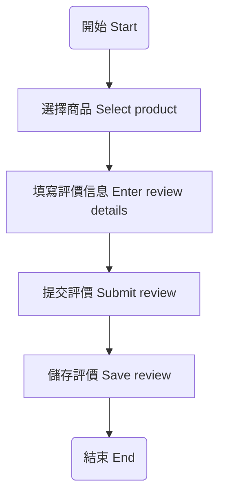
***

# 首頁

1.  點選「首頁」可進入首頁
2.  點選「所有產品」可進入所有產品頁面
3.  檢視本店熱銷商品名稱及價格
4.  點選圖片可以獲取商品詳細資料也可進行選購
5.  點選「點我看更多商品」可進入所有產品頁面

右上角：
* 放大鏡圖示：可透過關鍵字搜尋物品
* 人頭圖示：進入會員登入畫面
* 購物車圖示：進入購物車畫面

# 所有產品介面

1.	產品分類：麵包、餅乾、蛋糕、糕餅，可透過點擊選擇所需商品種類
2.	輸入關鍵字搜尋產品
3.	檢視商品外觀、名稱及價格
4.	點擊圖片可以獲取商品詳細資料也可進行選購
5.	點擊「選購」檢視商品外觀、名稱、價格、選購數量、產品介紹、小計與加入購物車
6.	點擊右方向上箭頭可回頁面頂部，下方左箭頭可回上一頁，右箭頭可到下一頁，數字列可以換至該頁
7.	點擊「立即結帳」進入結帳畫面

# 商品介面

1.	檢視商品外觀、名稱、價格、選購數量、產品介紹、小計、加入購物車與直接結帳

# 結帳頁面

1.	登入會員或註冊會員
2.	檢視目前已經選購商品及數量，並可刪除商品或更改選購數量
3.	可輸入優惠券號碼換取折扣
4.	點擊「立即結帳」輸入訂購資料

# 訂購介面

1.	點選運送方式及付款方式
2.	輸入收件資訊，也可會員登入跳過此步
3.	選擇性別、填寫信箱及備註即可送出
4.	開立發票並顯示資訊

# 登入與註冊會員介面

1.	會員可透過Facebook登入，沒有會員可以點擊「會員註冊」
2.	會員可透過Facebook註冊，已經是會員可以點擊「前往登入」
***

# ERD圖 (Entity-Relationship Diagram)
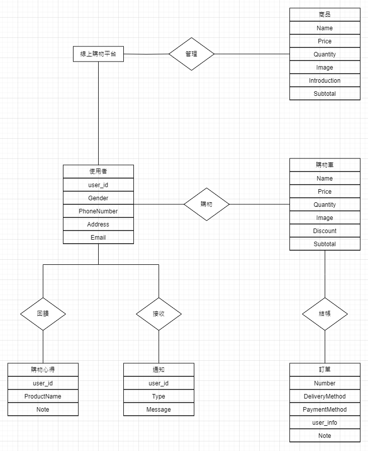
***
