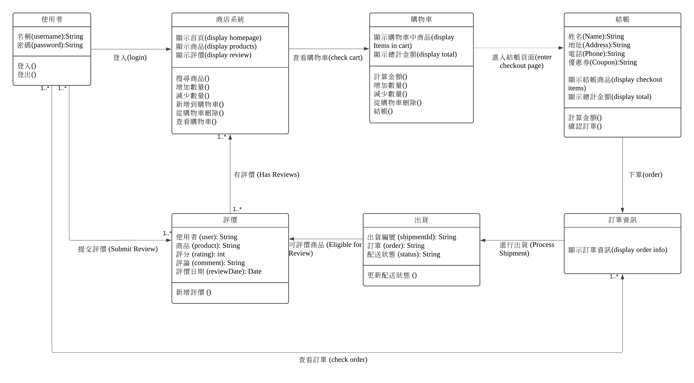
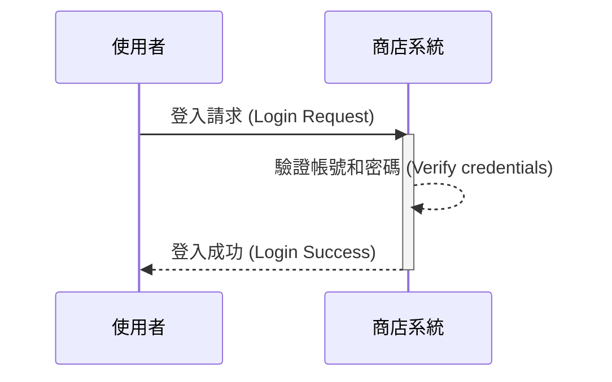
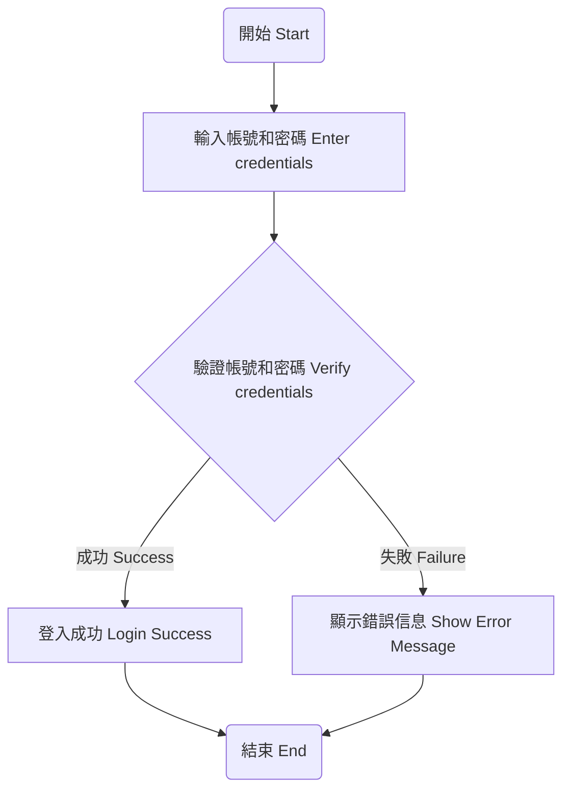
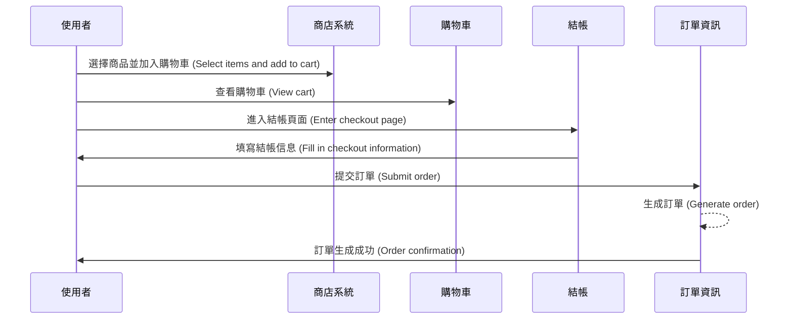
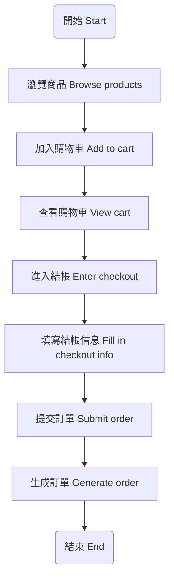
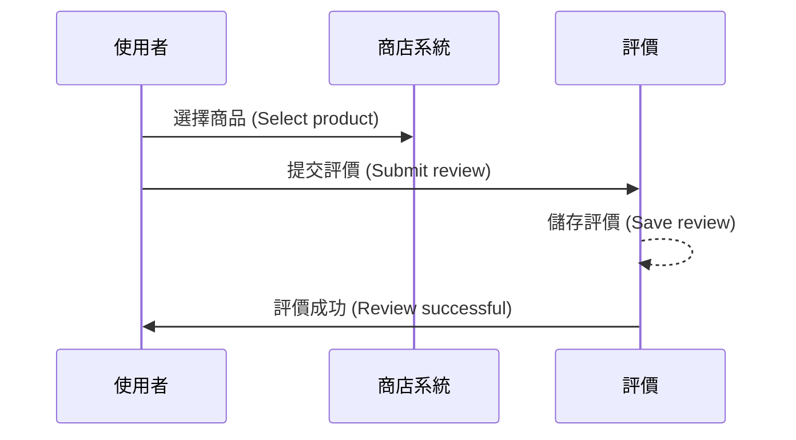
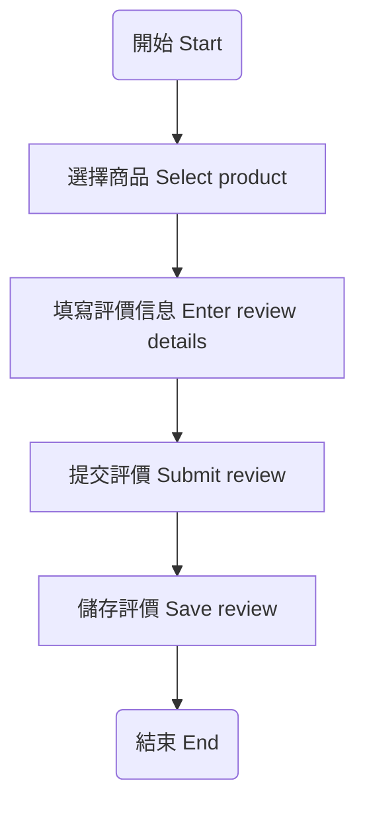

# UML類別圖 (Class Diagram)

# 使用案例一：使用者登入 (User Login)
## 循序圖

```mermaid
sequenceDiagram
    participant 使用者
    participant 商店系統

    使用者 ->> 商店系統: 登入請求 (Login Request)
    activate 商店系統
    商店系統 -->> 商店系統: 驗證帳號和密碼 (Verify credentials)
    商店系統 -->> 使用者: 登入成功 (Login Success)
    deactivate 商店系統
```
## 活動圖

```mermaid
graph TD
    A(開始 Start) --> B[輸入帳號和密碼 Enter credentials]
    B --> C{驗證帳號和密碼 Verify credentials}
    C -->|成功 Success| D[登入成功 Login Success]
    C -->|失敗 Failure| E[顯示錯誤信息 Show Error Message]
    D --> F(結束 End)
    E --> F
```
# 使用案例二：購物車結帳 (Checkout Shopping Cart)
## 循序圖

```mermaid
sequenceDiagram
    participant 使用者
    participant 商店系統
    participant 購物車
    participant 結帳
    participant 訂單資訊

    使用者 ->> 商店系統: 選擇商品並加入購物車 (Select items and add to cart)
    使用者 ->> 購物車: 查看購物車 (View cart)
    使用者 ->> 結帳: 進入結帳頁面 (Enter checkout page)
    結帳 ->> 使用者: 填寫結帳信息 (Fill in checkout information)
    使用者 ->> 訂單資訊: 提交訂單 (Submit order)
    訂單資訊 -->> 訂單資訊: 生成訂單 (Generate order)
    訂單資訊 ->> 使用者: 訂單生成成功 (Order confirmation)
```
## 活動圖

```mermaid
graph TD
    A(開始 Start) --> B[瀏覽商品 Browse products]
    B --> C[加入購物車 Add to cart]
    C --> D[查看購物車 View cart]
    D --> E[進入結帳 Enter checkout]
    E --> F[填寫結帳信息 Fill in checkout info]
    F --> G[提交訂單 Submit order]
    G --> H[生成訂單 Generate order]
    H --> I(結束 End)
```
# 使用案例三：商品評價 (Submit Review for Product)
## 循序圖

```mermaid
sequenceDiagram
    participant 使用者
    participant 商店系統
    participant 評價

    使用者 ->> 商店系統: 選擇商品 (Select product)
    使用者 ->> 評價: 提交評價 (Submit review)
    評價 -->> 評價: 儲存評價 (Save review)
    評價 ->> 使用者: 評價成功 (Review successful)
```
## 活動圖

```mermaid
graph TD
    A(開始 Start) --> B[選擇商品 Select product]
    B --> C[填寫評價信息 Enter review details]
    C --> D[提交評價 Submit review]
    D --> E[儲存評價 Save review]
    E --> F(結束 End)
```
