# 首頁

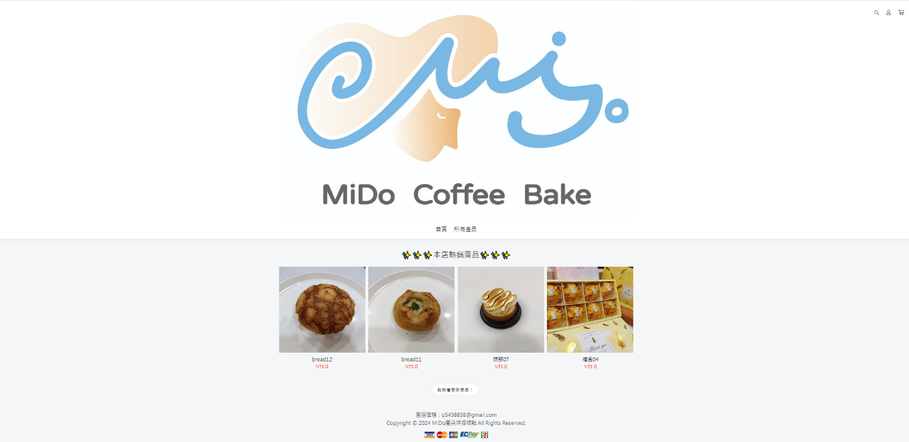

1.  點選「首頁」可進入首頁
2.  點選「所有產品」可進入所有產品頁面
3.  檢視本店熱銷商品名稱及價格
4.  點選圖片可以獲取商品詳細資料也可進行選購
5.  點選「點我看更多商品」可進入所有產品頁面

右上角：
* 放大鏡圖示：可透過關鍵字搜尋物品
* 人頭圖示：進入會員登入畫面
* 購物車圖示：進入購物車畫面

# 所有產品介面

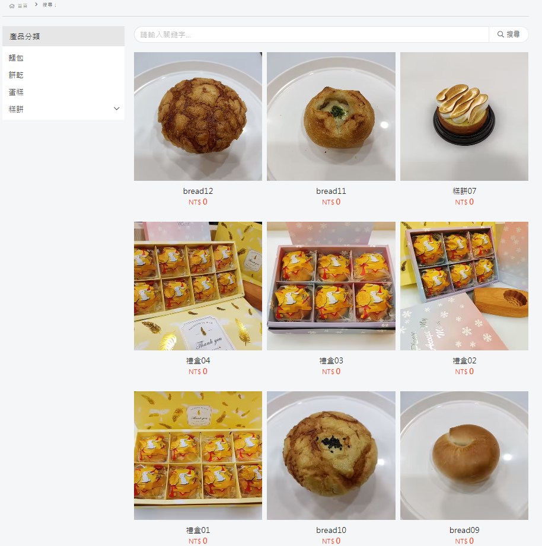

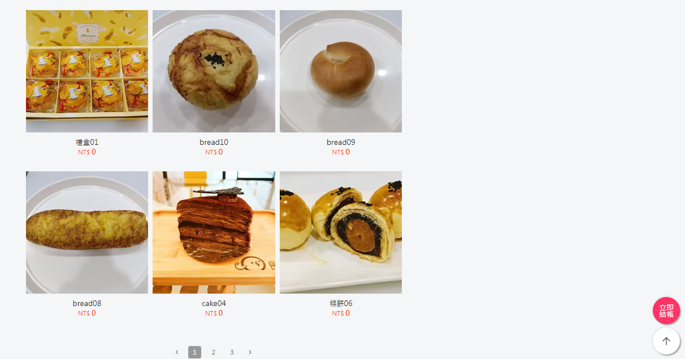

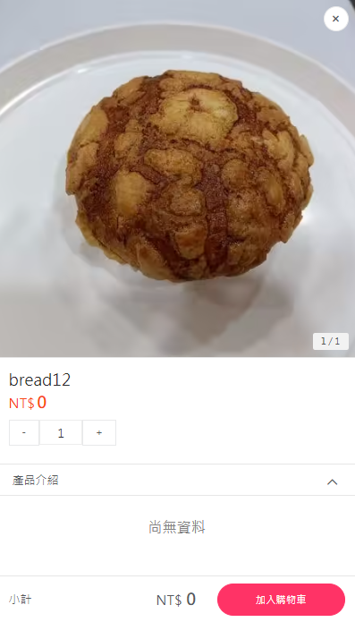

1.	產品分類：麵包、餅乾、蛋糕、糕餅，可透過點擊選擇所需商品種類
2.	輸入關鍵字搜尋產品
3.	檢視商品外觀、名稱及價格
4.	點擊圖片可以獲取商品詳細資料也可進行選購
5.	點擊「選購」檢視商品外觀、名稱、價格、選購數量、產品介紹、小計與加入購物車
6.	點擊右方向上箭頭可回頁面頂部，下方左箭頭可回上一頁，右箭頭可到下一頁，數字列可以換至該頁
7.	點擊「立即結帳」進入結帳畫面

# 商品介面

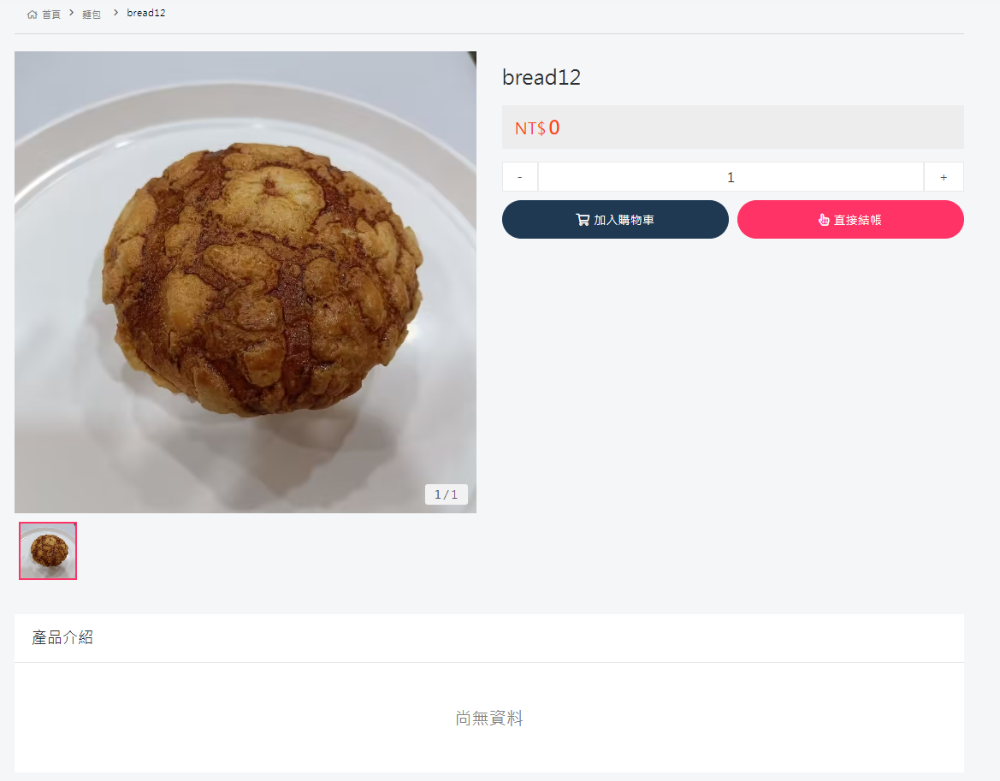

1.	檢視商品外觀、名稱、價格、選購數量、產品介紹、小計、加入購物車與直接結帳

# 結帳頁面

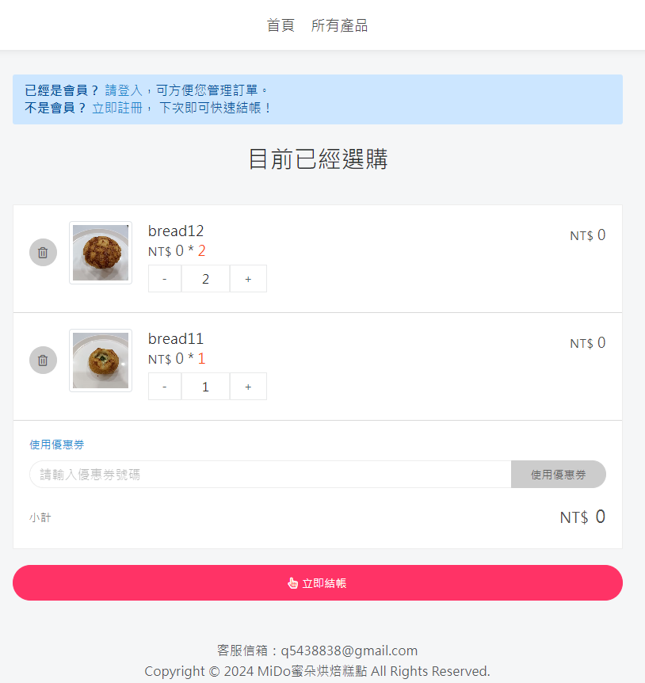

1.	登入會員或註冊會員
2.	檢視目前已經選購商品及數量，並可刪除商品或更改選購數量
3.	可輸入優惠券號碼換取折扣
4.	點擊「立即結帳」輸入訂購資料

# 訂購介面

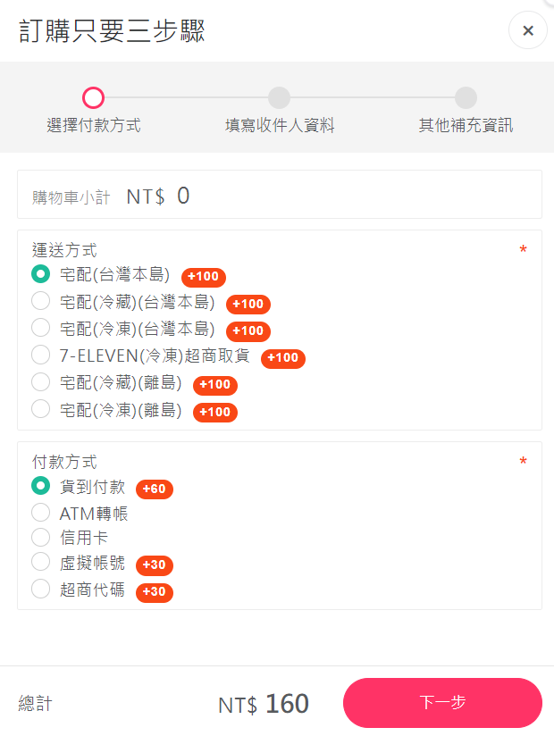

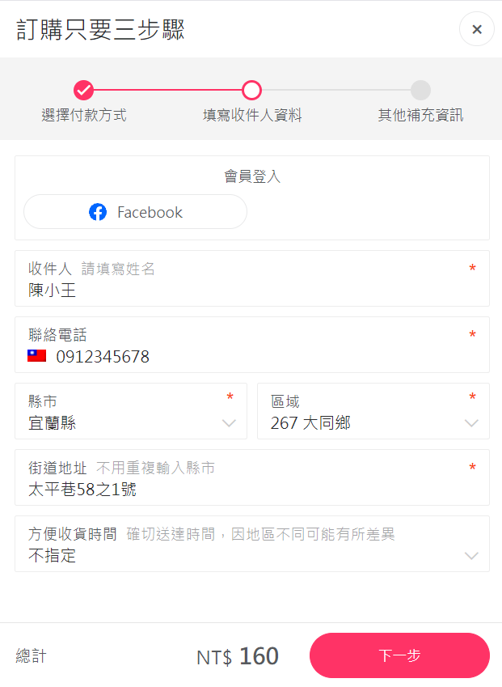

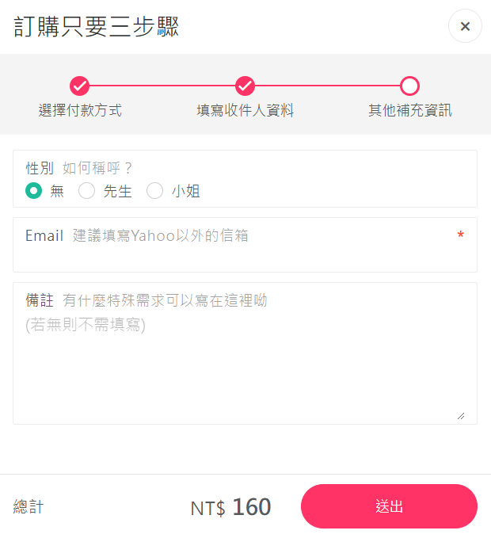

1.	點選運送方式及付款方式
2.	輸入收件資訊，也可會員登入跳過此步
3.	選擇性別、填寫信箱及備註即可送出
4.	開立發票並顯示資訊

# 登入與註冊會員介面

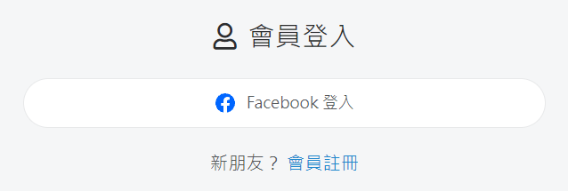

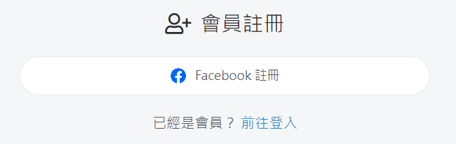

1.	會員可透過Facebook登入，沒有會員可以點擊「會員註冊」
2.	會員可透過Facebook註冊，已經是會員可以點擊「前往登入」
